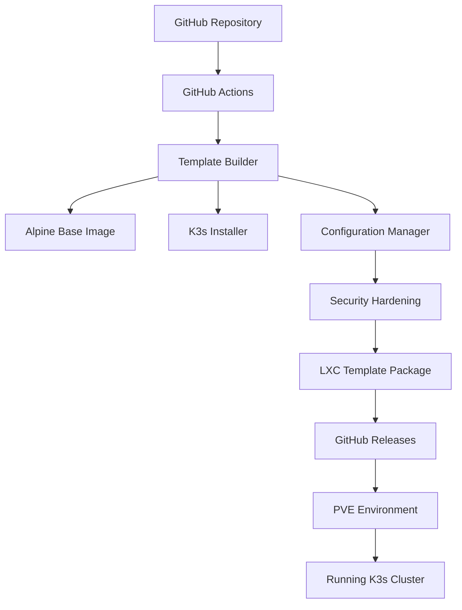

# 设计文档

## 概述

本系统设计一个自动化的 PVE LXC K3s 模板生成器，通过 GitHub Actions 自动构建和分发基于 Alpine Linux 的轻量级 Kubernetes 环境。系统采用模块化设计，支持自定义配置、安全加固和集群扩展。

## 架构

### 整体架构



### 核心组件

1. **模板构建器 (Template Builder)**
   - 负责协调整个构建流程
   - 管理构建环境和依赖
   - 处理错误和日志记录

2. **基础镜像管理器 (Base Image Manager)**
   - 下载和验证 Alpine Linux 基础镜像
   - 应用系统级别的配置和优化
   - 安装必要的系统包

3. **K3s 安装器 (K3s Installer)**
   - 下载并安装指定版本的 K3s
   - 配置 K3s 服务和启动脚本
   - 设置集群初始化参数

4. **配置管理器 (Configuration Manager)**
   - 处理用户自定义配置
   - 管理环境变量和配置文件
   - 支持模板参数化

5. **安全加固模块 (Security Hardening)**
   - 移除不必要的软件包
   - 配置防火墙规则
   - 设置用户权限和访问控制

6. **打包器 (Packager)**
   - 生成 LXC 模板文件
   - 创建元数据和配置文件
   - 压缩和优化模板大小

## 组件和接口

### 1. 构建流程接口

```yaml
# .github/workflows/build-template.yml
name: Build LXC Template
on:
  push:
    branches: [main]
    tags: ['v*']
  pull_request:
    branches: [main]

jobs:
  build:
    runs-on: ubuntu-latest
    steps:
      - name: Checkout
      - name: Setup Build Environment
      - name: Build Template
      - name: Test Template
      - name: Package and Release
```

### 2. 配置文件接口

```yaml
# config/template.yaml
template:
  name: "alpine-k3s"
  version: "1.0.0"
  base_image: "alpine:3.18"
  
k3s:
  version: "v1.28.4+k3s1"
  install_options:
    - "--disable=traefik"
    - "--disable=servicelb"
  cluster_init: true
  
system:
  timezone: "UTC"
  packages:
    - curl
    - wget
    - ca-certificates
  remove_packages:
    - apk-tools-doc
    
security:
  disable_root_login: true
  create_k3s_user: true
  firewall_rules:
    - "6443/tcp"  # K3s API
    - "10250/tcp" # Kubelet
```

### 3. 脚本接口

```bash
# scripts/build-template.sh
#!/bin/bash
set -euo pipefail

# 主构建函数
build_template() {
    setup_build_env
    download_base_image
    install_system_packages
    install_k3s
    apply_security_hardening
    create_startup_scripts
    package_template
}
```

## 数据模型

### 1. 模板配置模型

```yaml
TemplateConfig:
  metadata:
    name: string
    version: string
    description: string
    author: string
    created_at: datetime
  
  base:
    distribution: string
    version: string
    architecture: string
  
  k3s:
    version: string
    config: object
    addons: array
  
  system:
    packages: array
    services: array
    users: array
  
  network:
    interfaces: array
    firewall: object
  
  storage:
    volumes: array
    mounts: array
```

### 2. 构建状态模型

```yaml
BuildStatus:
  id: string
  status: enum [pending, building, testing, packaging, completed, failed]
  started_at: datetime
  completed_at: datetime
  logs: array
  artifacts: array
  errors: array
```

## 错误处理

### 1. 构建阶段错误处理

- **网络错误**: 实现重试机制，最多重试 3 次
- **包安装失败**: 记录详细错误信息，提供替代包建议
- **K3s 安装失败**: 检查系统兼容性，提供诊断信息
- **权限错误**: 验证用户权限，提供修复建议

### 2. 运行时错误处理

- **服务启动失败**: 提供服务状态检查和日志查看命令
- **网络配置错误**: 验证网络连通性，提供网络诊断工具
- **存储问题**: 检查磁盘空间和权限，提供清理建议

### 3. 错误日志格式

```json
{
  "timestamp": "2024-01-01T00:00:00Z",
  "level": "ERROR",
  "component": "k3s-installer",
  "message": "Failed to install K3s",
  "error": "curl: (7) Failed to connect to get.k3s.io port 443",
  "context": {
    "version": "v1.28.4+k3s1",
    "retry_count": 2,
    "max_retries": 3
  },
  "suggestions": [
    "Check internet connectivity",
    "Verify DNS resolution",
    "Try alternative download mirror"
  ]
}
```

## 测试策略

### 1. 单元测试

- **脚本函数测试**: 使用 bats 框架测试 shell 脚本函数
- **配置验证测试**: 测试配置文件解析和验证逻辑
- **工具函数测试**: 测试辅助工具和实用函数

### 2. 集成测试

- **构建流程测试**: 端到端测试完整的模板构建流程
- **K3s 安装测试**: 验证 K3s 在不同配置下的安装和启动
- **网络连通性测试**: 测试容器网络和服务发现

### 3. 系统测试

- **PVE 部署测试**: 在真实 PVE 环境中测试模板部署
- **性能测试**: 测试模板启动时间和资源使用
- **兼容性测试**: 测试不同 PVE 版本和 Alpine 版本的兼容性

### 4. 测试自动化

```yaml
# .github/workflows/test.yml
name: Test Template
on: [push, pull_request]

jobs:
  unit-tests:
    runs-on: ubuntu-latest
    steps:
      - name: Run Unit Tests
        run: make test-unit
  
  integration-tests:
    runs-on: ubuntu-latest
    steps:
      - name: Build Test Template
        run: make build-test
      - name: Run Integration Tests
        run: make test-integration
  
  system-tests:
    runs-on: ubuntu-latest
    needs: [unit-tests, integration-tests]
    steps:
      - name: Setup PVE Test Environment
        run: make setup-pve-test
      - name: Deploy and Test Template
        run: make test-system
```

### 5. 质量保证

- **代码覆盖率**: 目标达到 80% 以上的代码覆盖率
- **静态分析**: 使用 shellcheck 检查 shell 脚本质量
- **安全扫描**: 使用 trivy 扫描容器镜像安全漏洞
- **性能基准**: 建立启动时间和资源使用的性能基准

### 6. 测试数据管理

- **测试配置**: 维护不同场景的测试配置文件
- **测试环境**: 使用 Docker 创建隔离的测试环境
- **测试报告**: 生成详细的测试报告和覆盖率报告