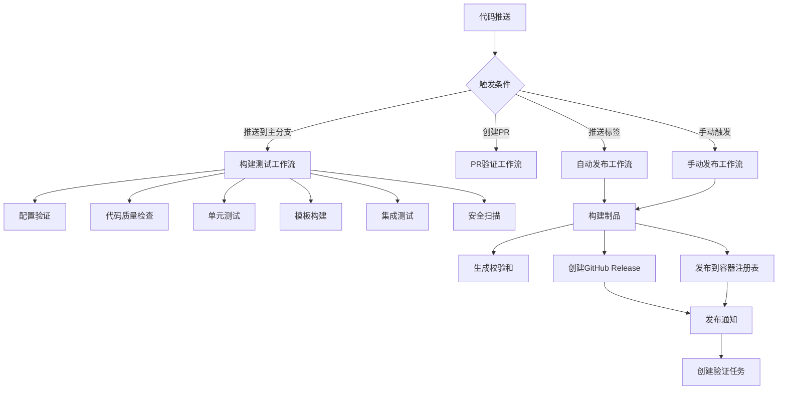

# GitHub Actions 系统总结

## 🎯 系统概述

PVE LXC K3s Template 项目现已配备完整的 GitHub Actions 自动化系统，提供从代码提交到制品发布的全自动化流程。

## 📊 工作流架构



## 🛠️ 工作流详情

### 1. 主构建工作流 (build-template.yml)

**文件**: `.github/workflows/build-template.yml`

**功能**: 完整的构建、测试和发布流程

**触发条件**:
- ✅ 推送到 `main` 或 `develop` 分支
- ✅ Pull Request 到 `main` 分支
- ✅ 推送版本标签 (`v*`)
- ✅ 手动触发

**作业流程**:
1. **配置验证** - 验证 YAML 配置文件
2. **代码质量检查** - 运行 shellcheck 和权限检查
3. **单元测试** - 运行 BATS 测试框架
4. **模板构建** - 构建 LXC 模板
5. **集成测试** - 验证模板完整性
6. **安全扫描** - 使用 Trivy 扫描漏洞
7. **自动发布** - 标签触发时创建 Release

### 2. 发布制品工作流 (publish-artifacts.yml)

**文件**: `.github/workflows/publish-artifacts.yml`

**功能**: 专门用于构建和发布制品

**触发条件**:
- ✅ 推送版本标签 (`v*`)
- ✅ 手动触发

**作业流程**:
1. **构建制品** - 构建发布版本的模板
2. **创建发布** - 创建 GitHub Release
3. **发布容器** - 发布到 GitHub Container Registry
4. **成功通知** - 创建成功通知和验证任务

### 3. 手动发布工作流 (manual-release.yml)

**文件**: `.github/workflows/manual-release.yml`

**功能**: 提供完全可控的手动发布流程

**触发条件**:
- ✅ 仅手动触发

**输入参数**:
- `version`: 版本号 (如 v1.0.0)
- `release_type`: 发布类型 (release/prerelease/draft)
- `release_notes`: 自定义发布说明

**作业流程**:
1. **验证输入** - 验证版本格式和参数
2. **构建制品** - 构建指定版本的制品
3. **创建发布** - 创建自定义的 GitHub Release
4. **后续处理** - 创建验证任务和通知

### 4. 测试构建工作流 (test-build.yml)

**文件**: `.github/workflows/test-build.yml`

**功能**: 快速测试构建系统

**触发条件**:
- ✅ 手动触发
- ✅ 推送到 `test-*` 分支

**测试模式**:
- `quick`: 快速验证
- `full`: 完整测试

### 5. 其他支持工作流

#### 变更日志工作流 (changelog.yml)
- 自动生成变更日志
- 创建发布草稿
- 更新文档

#### 依赖更新工作流 (update-dependencies.yml)
- 定时检查 K3s 和 Alpine 版本更新
- 自动创建更新 PR
- 安全更新通知

## 🚀 使用场景

### 场景 1: 日常开发

```bash
# 开发者推送代码
git push origin feature/new-feature

# 创建 PR
gh pr create --title "Add new feature"

# 自动触发：
# - 代码质量检查
# - 单元测试
# - 构建验证
```

### 场景 2: 发布新版本

```bash
# 方式 A: 标签自动发布
git tag -a v1.0.0 -m "Release v1.0.0"
git push origin v1.0.0

# 方式 B: 手动发布
# 通过 GitHub Actions 界面手动触发
```

### 场景 3: 紧急修复

```bash
# 创建修复分支
git checkout -b hotfix/security-fix

# 修复问题并测试
git commit -m "fix: security vulnerability"

# 合并并发布
git checkout main
git merge hotfix/security-fix
git tag -a v1.0.1 -m "Hotfix v1.0.1"
git push origin main v1.0.1
```

### 场景 4: 预发布测试

```bash
# 创建预发布版本
git tag -a v1.1.0-beta -m "Beta release"
git push origin v1.1.0-beta

# 或使用手动工作流创建预发布
```

## 📦 制品管理

### 发布制品

每个发布自动包含：

- **模板文件**: `alpine-k3s-{version}.tar.gz`
- **校验和文件**: SHA256, SHA512, MD5
- **容器镜像**: `ghcr.io/{owner}/{repo}:{version}`
- **发布说明**: 自动生成的详细说明

### 版本管理

- **语义化版本**: v1.0.0, v1.1.0, v2.0.0
- **预发布版本**: v1.0.0-alpha, v1.0.0-beta, v1.0.0-rc1
- **自动标记**: 预发布版本自动标记为 prerelease

### 容器注册表

- **主镜像**: `ghcr.io/{owner}/{repo}:latest`
- **版本镜像**: `ghcr.io/{owner}/{repo}:v1.0.0`
- **语义标签**: `ghcr.io/{owner}/{repo}:1`, `ghcr.io/{owner}/{repo}:1.0`

## 🔧 配置和自定义

### 环境变量

```yaml
env:
  TEMPLATE_NAME: alpine-k3s
  BUILD_CACHE_KEY: build-cache-v1
  REGISTRY: ghcr.io
```

### 权限配置

```yaml
permissions:
  contents: write      # 创建发布
  packages: write      # 发布容器镜像
  pull-requests: write # PR 评论
  issues: write        # 创建通知
```

### 缓存策略

- **构建缓存**: 缓存构建依赖和中间文件
- **依赖缓存**: 缓存下载的包和工具
- **缓存键**: 基于配置文件哈希值

## 📊 监控和通知

### 自动通知

- **构建摘要**: 每次构建后的详细摘要
- **PR 评论**: Pull Request 中的构建状态
- **Issue 创建**: 发布后的验证任务
- **失败通知**: 构建失败时的问题创建

### 状态跟踪

- **工作流状态**: 实时显示构建进度
- **制品状态**: 跟踪制品生成和上传
- **发布状态**: 监控发布创建和分发

### 日志管理

- **结构化日志**: 详细的构建日志
- **错误追踪**: 失败时的详细错误信息
- **性能指标**: 构建时间和资源使用

## 🔒 安全特性

### 安全扫描

- **漏洞扫描**: 使用 Trivy 扫描安全漏洞
- **代码质量**: shellcheck 静态分析
- **权限检查**: 脚本权限验证

### 访问控制

- **最小权限**: 工作流使用最小必要权限
- **Token 管理**: 安全的 GitHub Token 使用
- **分支保护**: 主分支保护规则

### 制品安全

- **校验和验证**: 多种校验和算法
- **签名验证**: 制品完整性验证
- **不可变性**: 发布后制品不可修改

## 📈 性能优化

### 构建优化

- **并行构建**: 多作业并行执行
- **缓存利用**: 智能缓存策略
- **增量构建**: 仅构建变更部分

### 资源管理

- **资源限制**: 合理的资源分配
- **超时控制**: 防止无限等待
- **清理策略**: 自动清理临时文件

### 网络优化

- **镜像缓存**: 缓存基础镜像
- **并发下载**: 并行下载依赖
- **CDN 加速**: 使用 GitHub CDN

## 🛠️ 维护和扩展

### 定期维护

- **依赖更新**: 自动检查和更新依赖
- **工作流更新**: 定期更新 Actions 版本
- **安全更新**: 及时应用安全补丁

### 扩展能力

- **自定义工作流**: 支持添加自定义工作流
- **插件系统**: 支持第三方集成
- **API 集成**: 与外部系统集成

### 监控改进

- **指标收集**: 收集构建和发布指标
- **性能分析**: 分析构建性能瓶颈
- **用户反馈**: 收集和处理用户反馈

## 🎯 最佳实践

### 开发流程

1. **功能开发**: 在功能分支上开发
2. **测试验证**: 创建 PR 触发自动测试
3. **代码审查**: 团队审查代码质量
4. **合并发布**: 合并后创建版本标签

### 发布管理

1. **版本规划**: 使用语义化版本号
2. **测试发布**: 使用预发布版本测试
3. **正式发布**: 创建正式版本发布
4. **后续维护**: 及时修复问题和更新

### 质量保证

1. **自动测试**: 完整的测试覆盖
2. **安全扫描**: 定期安全检查
3. **性能监控**: 监控构建性能
4. **用户反馈**: 收集使用反馈

## 🎉 总结

GitHub Actions 自动化系统为 PVE LXC K3s Template 项目提供了：

- **完全自动化**: 从代码到发布的全自动流程
- **高质量保证**: 多层次的测试和验证
- **灵活发布**: 支持多种发布场景
- **安全可靠**: 完整的安全控制和验证
- **易于使用**: 简单的标签触发机制
- **可扩展性**: 支持自定义和扩展

通过这套系统，开发者可以专注于功能开发，而发布和分发完全自动化处理。