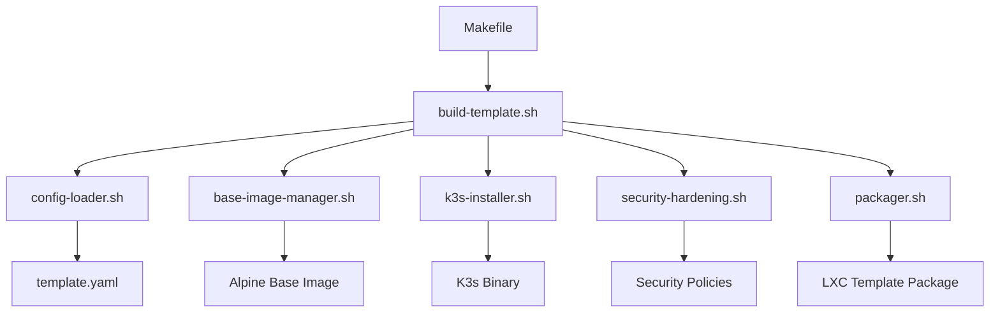

# 开发者文档

本文档为希望参与 PVE LXC K3s 模板生成器开发的开发者提供详细的指导信息。

## 项目概述

PVE LXC K3s 模板生成器是一个自动化工具，用于创建基于 Alpine Linux 的 LXC 容器模板，预装并配置 K3s Kubernetes 集群。项目采用模块化设计，支持自定义配置、安全加固和集群扩展。

### 技术栈

- **Shell 脚本**: 主要实现语言，使用 Bash
- **YAML**: 配置文件格式
- **JSON**: 元数据和 API 响应格式
- **Docker**: 构建环境和测试
- **GitHub Actions**: CI/CD 自动化
- **BATS**: Shell 脚本测试框架

## 开发环境设置

### 前置要求

#### 系统要求
- **操作系统**: Linux (推荐 Ubuntu 20.04+)
- **Shell**: Bash 4.0+
- **内存**: 至少 4GB
- **存储**: 至少 20GB 可用空间
- **网络**: 稳定的互联网连接

#### 必需工具
```bash
# 基础工具
sudo apt update
sudo apt install -y \
  curl \
  wget \
  git \
  make \
  jq \
  yq \
  shellcheck \
  yamllint

# Docker (用于构建和测试)
curl -fsSL https://get.docker.com | sh
sudo usermod -aG docker $USER

# BATS 测试框架
git clone https://github.com/bats-core/bats-core.git
cd bats-core
sudo ./install.sh /usr/local
```

#### 可选工具
```bash
# 开发辅助工具
sudo apt install -y \
  tree \
  htop \
  vim \
  code  # VS Code

# 性能分析工具
sudo apt install -y \
  time \
  strace \
  ltrace
```

### 克隆项目

```bash
# 克隆主仓库
git clone https://github.com/your-username/pve-lxc-k3s-template.git
cd pve-lxc-k3s-template

# 设置上游仓库（如果是 fork）
git remote add upstream https://github.com/original-owner/pve-lxc-k3s-template.git
```

### 初始化开发环境

```bash
# 安装开发依赖
make dev-setup

# 验证环境
make check-env

# 运行基础测试
make test-unit
```

## 代码结构和架构

### 目录结构

```
pve-lxc-k3s-template/
├── .github/                    # GitHub Actions 工作流
│   └── workflows/
│       ├── build-template.yml  # 模板构建工作流
│       ├── test.yml            # 测试工作流
│       └── release.yml         # 发布工作流
├── config/                     # 配置文件
│   ├── template.yaml           # 主配置文件
│   └── template-schema.json    # 配置文件 JSON Schema
├── docs/                       # 文档目录
│   ├── README.md               # 文档索引
│   ├── installation.md         # 安装指南
│   ├── configuration.md        # 配置指南
│   ├── troubleshooting.md      # 故障排查
│   ├── development.md          # 开发者文档（本文件）
│   └── api.md                  # API 文档
├── scripts/                    # 核心脚本
│   ├── build-template.sh       # 主构建脚本
│   ├── base-image-manager.sh   # 基础镜像管理
│   ├── k3s-installer.sh        # K3s 安装器
│   ├── config-loader.sh        # 配置加载器
│   ├── security-hardening.sh   # 安全加固
│   ├── packager.sh             # 模板打包器
│   ├── template-validator.sh   # 模板验证器
│   ├── system-diagnostics.sh   # 系统诊断
│   ├── monitoring.sh           # 监控脚本
│   └── logging.sh              # 日志管理
├── tests/                      # 测试文件
│   ├── run-unit-tests.sh       # 单元测试运行器
│   ├── run-integration-tests.sh # 集成测试运行器
│   ├── run-system-tests.sh     # 系统测试运行器
│   └── test-*.bats             # BATS 测试文件
├── logs/                       # 日志目录
├── output/                     # 构建输出目录
├── Makefile                    # 构建和任务管理
└── README.md                   # 项目说明
```

### 核心组件架构

#### 1. 构建系统 (Build System)



#### 2. 配置管理 (Configuration Management)

```bash
# 配置加载流程
config-loader.sh
├── 验证配置文件语法
├── 解析 YAML 配置
├── 设置环境变量
├── 验证必需参数
└── 生成运行时配置
```

#### 3. 模块化设计

每个脚本都遵循统一的接口设计：

```bash
#!/bin/bash
# 脚本模板结构

set -euo pipefail

# 全局变量
SCRIPT_DIR="$(cd "$(dirname "${BASH_SOURCE[0]}")" && pwd)"
PROJECT_ROOT="$(dirname "$SCRIPT_DIR")"

# 导入公共函数
source "$SCRIPT_DIR/logging.sh"

# 主函数
main() {
    local action="${1:-default}"
    
    case "$action" in
        "action1") action1_function ;;
        "action2") action2_function ;;
        "help"|"-h"|"--help") show_help ;;
        *) default_action ;;
    esac
}

# 如果直接执行脚本
if [[ "${BASH_SOURCE[0]}" == "${0}" ]]; then
    main "$@"
fi
```

## API 文档和接口

### 脚本接口规范

#### 1. 命令行接口

所有脚本都支持统一的命令行接口：

```bash
# 基本用法
script-name.sh [OPTIONS] [COMMAND] [ARGS...]

# 通用选项
--config FILE     # 指定配置文件
--debug          # 启用调试模式
--verbose        # 详细输出
--help           # 显示帮助信息
--version        # 显示版本信息
```

#### 2. 返回码规范

| 返回码 | 含义 | 使用场景 |
|--------|------|----------|
| 0 | 成功 | 正常执行完成 |
| 1 | 一般错误 | 脚本执行失败 |
| 2 | 参数错误 | 命令行参数无效 |
| 3 | 配置错误 | 配置文件问题 |
| 4 | 网络错误 | 网络连接失败 |
| 5 | 权限错误 | 文件或目录权限不足 |
| 6 | 资源不足 | 磁盘空间或内存不足 |

#### 3. 日志格式规范

```json
{
  "timestamp": "2024-01-01T00:00:00Z",
  "level": "INFO|WARN|ERROR|DEBUG",
  "component": "script-name",
  "message": "Human readable message",
  "context": {
    "key": "value"
  }
}
```

### 核心脚本 API

#### build-template.sh

```bash
# 构建模板
./scripts/build-template.sh [OPTIONS] build

# 选项
--config FILE           # 配置文件路径
--output-dir DIR        # 输出目录
--base-image IMAGE      # 基础镜像
--k3s-version VERSION   # K3s 版本
--debug                 # 调试模式

# 示例
./scripts/build-template.sh --config config/prod.yaml build
```

#### packager.sh

```bash
# 打包模板
./scripts/packager.sh [OPTIONS] COMMAND

# 命令
package                 # 打包模板（默认）
verify                  # 验证模板包
info                    # 显示模板信息
clean                   # 清理输出

# 示例
./scripts/packager.sh --debug package
./scripts/packager.sh verify output/template.tar.gz
```

#### template-validator.sh

```bash
# 验证模板
./scripts/template-validator.sh [OPTIONS] COMMAND

# 命令
validate                # 完整验证（默认）
quick                   # 快速验证
package-only            # 仅验证包
performance             # 性能测试

# 示例
./scripts/template-validator.sh validate
./scripts/template-validator.sh --timeout 300 quick
```

## 贡献指南

### 开发流程

#### 1. 准备工作

```bash
# 1. Fork 项目到你的 GitHub 账户
# 2. 克隆你的 fork
git clone https://github.com/your-username/pve-lxc-k3s-template.git
cd pve-lxc-k3s-template

# 3. 添加上游仓库
git remote add upstream https://github.com/original-owner/pve-lxc-k3s-template.git

# 4. 创建开发分支
git checkout -b feature/your-feature-name
```

#### 2. 开发规范

**代码风格**:
- 使用 4 空格缩进
- 函数名使用下划线分隔 (`function_name`)
- 变量名使用下划线分隔 (`variable_name`)
- 常量使用大写字母 (`CONSTANT_NAME`)
- 使用双引号包围字符串变量

**Shell 脚本最佳实践**:
```bash
#!/bin/bash
# 总是使用 strict mode
set -euo pipefail

# 使用本地变量
local variable_name="value"

# 检查命令是否存在
if ! command -v docker &> /dev/null; then
    echo "Error: docker is not installed"
    exit 1
fi

# 使用数组处理多个值
local packages=("curl" "wget" "jq")
for package in "${packages[@]}"; do
    echo "Installing $package"
done

# 错误处理
if ! some_command; then
    log_error "Command failed"
    return 1
fi
```

#### 3. 测试要求

**单元测试**:
```bash
# 为新功能编写 BATS 测试
# tests/test-your-feature.bats

@test "should handle valid input" {
    run your_function "valid_input"
    [ "$status" -eq 0 ]
    [[ "$output" =~ "expected_output" ]]
}

@test "should fail with invalid input" {
    run your_function "invalid_input"
    [ "$status" -eq 1 ]
}
```

**集成测试**:
```bash
# 测试完整的工作流程
@test "should build template successfully" {
    run make build
    [ "$status" -eq 0 ]
    [ -f "output/template.tar.gz" ]
}
```

#### 4. 提交规范

**提交信息格式**:
```
type(scope): description

[optional body]

[optional footer]
```

**类型说明**:
- `feat`: 新功能
- `fix`: 错误修复
- `docs`: 文档更新
- `style`: 代码格式化
- `refactor`: 代码重构
- `test`: 测试相关
- `chore`: 构建或辅助工具

**示例**:
```
feat(k3s): add support for custom CNI plugins

- Add configuration option for CNI plugin selection
- Implement Calico and Cilium support
- Update documentation with CNI configuration examples

Closes #123
```

#### 5. Pull Request 流程

```bash
# 1. 确保代码质量
make lint
make test

# 2. 提交更改
git add .
git commit -m "feat(scope): description"

# 3. 推送到你的 fork
git push origin feature/your-feature-name

# 4. 创建 Pull Request
# 在 GitHub 上创建 PR，填写详细描述
```

**PR 检查清单**:
- [ ] 代码通过所有测试
- [ ] 添加了必要的测试
- [ ] 更新了相关文档
- [ ] 遵循代码风格规范
- [ ] 提交信息清晰明确
- [ ] 没有合并冲突

### 代码审查

#### 审查要点

1. **功能正确性**
   - 代码是否实现了预期功能
   - 边界条件是否正确处理
   - 错误处理是否完善

2. **代码质量**
   - 代码是否清晰易读
   - 是否遵循项目规范
   - 是否有重复代码

3. **性能考虑**
   - 是否有性能瓶颈
   - 资源使用是否合理
   - 是否有内存泄漏

4. **安全性**
   - 是否有安全漏洞
   - 输入验证是否充分
   - 权限控制是否正确

#### 审查流程

```bash
# 1. 检出 PR 分支
git fetch upstream pull/123/head:pr-123
git checkout pr-123

# 2. 运行测试
make test-all

# 3. 手动测试
make build
make validate

# 4. 代码审查
# 使用 GitHub 界面进行代码审查
# 提供建设性反馈
```

## 扩展开发指南

### 添加新功能

#### 1. 添加新的构建步骤

```bash
# 1. 创建新脚本
touch scripts/new-feature.sh
chmod +x scripts/new-feature.sh

# 2. 实现脚本逻辑
cat > scripts/new-feature.sh << 'EOF'
#!/bin/bash
set -euo pipefail

source "$(dirname "$0")/logging.sh"

new_feature_function() {
    log_info "Implementing new feature"
    # 实现逻辑
}

main() {
    case "${1:-default}" in
        "action") new_feature_function ;;
        *) new_feature_function ;;
    esac
}

if [[ "${BASH_SOURCE[0]}" == "${0}" ]]; then
    main "$@"
fi
EOF

# 3. 集成到主构建流程
# 在 build-template.sh 中添加调用
```

#### 2. 添加配置选项

```yaml
# 1. 更新 config/template.yaml
new_feature:
  enabled: true
  option1: "value1"
  option2: "value2"

# 2. 更新 config/template-schema.json
{
  "properties": {
    "new_feature": {
      "type": "object",
      "properties": {
        "enabled": {"type": "boolean"},
        "option1": {"type": "string"},
        "option2": {"type": "string"}
      }
    }
  }
}

# 3. 更新配置加载逻辑
# 在 config-loader.sh 中添加解析逻辑
```

#### 3. 添加测试

```bash
# 1. 创建单元测试
cat > tests/test-new-feature.bats << 'EOF'
#!/usr/bin/env bats

load test_helper

@test "new feature should work correctly" {
    run scripts/new-feature.sh action
    [ "$status" -eq 0 ]
    [[ "$output" =~ "expected result" ]]
}
EOF

# 2. 添加集成测试
# 在 tests/test-integration.bats 中添加测试用例
```

### 自定义 CNI 插件支持

```bash
# 示例：添加 Calico 支持

# 1. 更新配置
# config/template.yaml
k3s:
  cni_plugin: "calico"
  cni_options:
    - "--flannel-backend=none"
    - "--disable-network-policy"

# 2. 实现安装逻辑
# scripts/cni-installer.sh
install_calico() {
    log_info "Installing Calico CNI"
    
    # 下载 Calico 清单
    curl -O https://raw.githubusercontent.com/projectcalico/calico/v3.26.1/manifests/calico.yaml
    
    # 应用配置
    kubectl apply -f calico.yaml
}

# 3. 集成到构建流程
# 在 k3s-installer.sh 中添加 CNI 安装步骤
```

### 添加监控支持

```bash
# 示例：集成 Prometheus 监控

# 1. 创建监控脚本
# scripts/monitoring-setup.sh
setup_prometheus() {
    log_info "Setting up Prometheus monitoring"
    
    # 创建监控命名空间
    kubectl create namespace monitoring
    
    # 部署 Prometheus
    kubectl apply -f manifests/prometheus.yaml
}

# 2. 添加配置选项
# config/template.yaml
monitoring:
  enabled: true
  prometheus:
    version: "v2.45.0"
    retention: "15d"
  grafana:
    enabled: true
    admin_password: "admin"
```

## 调试和故障排查

### 调试技巧

#### 1. 启用调试模式

```bash
# 全局调试
export DEBUG=1
make build

# 脚本级调试
./scripts/build-template.sh --debug build

# Bash 调试
bash -x scripts/build-template.sh build
```

#### 2. 日志分析

```bash
# 查看构建日志
tail -f logs/build.log

# 过滤错误信息
grep -i error logs/*.log

# 分析性能
time make build
```

#### 3. 交互式调试

```bash
# 在脚本中添加断点
read -p "Press Enter to continue..."

# 使用 bashdb 调试器
bashdb scripts/build-template.sh
```

### 常见开发问题

#### 1. 权限问题

```bash
# 确保脚本可执行
find scripts/ -name "*.sh" -exec chmod +x {} \;

# 检查文件权限
ls -la scripts/
```

#### 2. 路径问题

```bash
# 使用绝对路径
SCRIPT_DIR="$(cd "$(dirname "${BASH_SOURCE[0]}")" && pwd)"
PROJECT_ROOT="$(dirname "$SCRIPT_DIR")"

# 相对路径处理
source "$SCRIPT_DIR/logging.sh"
```

#### 3. 变量作用域

```bash
# 使用 local 声明局部变量
function_name() {
    local local_var="value"
    # 避免污染全局命名空间
}
```

## 性能优化

### 构建性能优化

```bash
# 1. 并行构建
make -j$(nproc) build

# 2. 缓存优化
# 使用构建缓存避免重复下载
if [[ ! -f "cache/k3s-${K3S_VERSION}" ]]; then
    download_k3s
fi

# 3. 增量构建
# 只重建变更的部分
if [[ "config/template.yaml" -nt "output/template.tar.gz" ]]; then
    rebuild_template
fi
```

### 脚本性能优化

```bash
# 1. 避免不必要的子进程
# 使用内置命令替代外部命令
[[ "$var" =~ pattern ]] # 而不是 echo "$var" | grep pattern

# 2. 批量操作
# 一次性处理多个文件
find . -name "*.tmp" -delete # 而不是逐个删除

# 3. 缓存计算结果
# 避免重复计算
if [[ -z "$cached_result" ]]; then
    cached_result=$(expensive_calculation)
fi
```

## 发布管理

### 版本控制

```bash
# 语义化版本
MAJOR.MINOR.PATCH

# 版本标记
git tag -a v1.2.3 -m "Release version 1.2.3"
git push origin v1.2.3
```

### 自动化发布

```yaml
# .github/workflows/release.yml
name: Release
on:
  push:
    tags: ['v*']

jobs:
  release:
    runs-on: ubuntu-latest
    steps:
      - uses: actions/checkout@v3
      - name: Build Template
        run: make build
      - name: Create Release
        uses: actions/create-release@v1
        with:
          tag_name: ${{ github.ref }}
          release_name: Release ${{ github.ref }}
          draft: false
          prerelease: false
```

## 社区参与

### 获取帮助

- **GitHub Issues**: 报告问题和请求功能
- **GitHub Discussions**: 社区讨论和问答
- **Wiki**: 详细文档和教程

### 贡献方式

1. **代码贡献**: 提交 Pull Request
2. **文档改进**: 更新和完善文档
3. **问题报告**: 报告 bug 和问题
4. **功能建议**: 提出新功能想法
5. **测试反馈**: 测试新版本并提供反馈

### 维护者职责

- 代码审查和合并 PR
- 问题分类和处理
- 版本发布管理
- 社区沟通协调
- 文档维护更新

## 总结

本开发者文档提供了参与 PVE LXC K3s 模板生成器开发所需的全部信息。通过遵循这些指导原则和最佳实践，您可以有效地为项目做出贡献。

如果您有任何问题或建议，请随时通过 GitHub Issues 或 Discussions 与我们联系。我们欢迎所有形式的贡献，并感谢您对项目的支持！

## 参考资源

- [Bash 编程指南](https://www.gnu.org/software/bash/manual/)
- [BATS 测试框架](https://github.com/bats-core/bats-core)
- [ShellCheck 静态分析](https://www.shellcheck.net/)
- [K3s 官方文档](https://docs.k3s.io/)
- [LXC 容器技术](https://linuxcontainers.org/lxc/)
- [Proxmox VE 文档](https://pve.proxmox.com/pve-docs/)